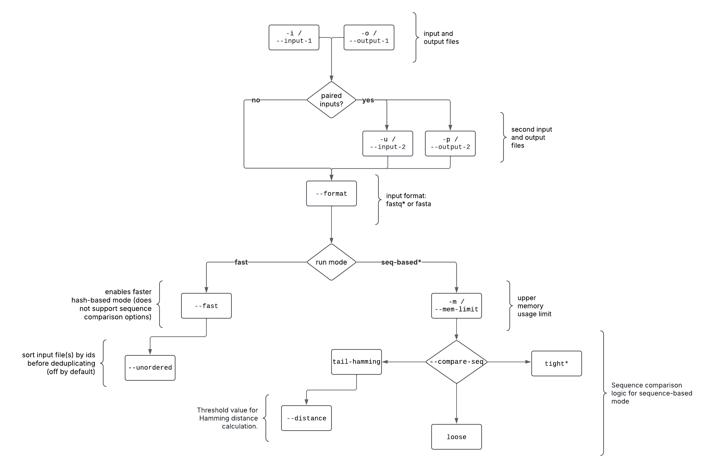

# fastq-dupaway algorithm and options.

fastq-dupaway provides the user with a variety of options for flexible workflow customization. The program may operate on single-end or paired-end inputs, supports fastq and fasta file formats and works with both plain and gz-compressed files.

The user can choose between two deduplication algorithms:

* a "sequence-based" mode that allows setting an upper limit for memory usage and fine-tuning sequence comparison logic but is also disk-usage-intensive;

* a "fast" mode that does not allow managing memory limit and only removes direct duplicates.

A list of available options is presented in the following block diagram. Options enabled by default are marked with <b>*</b>.

  

## Sequence-based mode

This mode operates by comparing sequences directly. During execution, memory usage is controlled to <i>almost always</i> be equal to or below the user-defined threshold (although slight overshoot may be detected in the case of big number of sequences of extra short length). This mode consists of two steps: Sorting and Comparing. This mode is recommended to use when dealing with large files and limited computing resources.

First, contents of input file(s) are sorted by sequences. If paired inputs were provided, the "left" and "right" reads from each pair are guaranteed to be sorted together. The program uses a variation of an "external sort" algorithm: it splits input files into chunks stored on disk, sorts each chunk independently and the merges all chunks together. During operation in this mode, the program will create temporal files totalling in approximately <b>2X input size</b>.
 <b>NB:</b> Due to lots of read-write operations, this step is disk-usage-intensive. Caution is advised when running several fastq-dupaway processes in seq-based mode with large inputs in parallel.

During second step, the program reads sorted input and removes duplicated records that were clumped together in one go. The logic of defining a "duplicate" currently supports 3 options:

1. "tight" mode (enabled by default). Only complete sequence duplicates are removed. Sequences of different lengths are automatically considered non-duplicates. The process is depicted on the following Fig.1: out of 3 input sequences first two are complete duplicates of each other and the third one differs from those by one nucleotide. After program execution, only first and third sequences are preserved.

 Fig. 1. "tight" deduplication of single-end input.  

2. "loose" mode. This mode follows the logic of program "[fastuniq](https://sourceforge.net/projects/fastuniq/)." During sequence comparison, sequences of different lengths are considered duplicates if shorter sequence exactly matches with prefix of longer sequence. In that case, out of duplicate stack the first sequence is preserved, but the longer one is kept for further comparison. The process is depicted on the following Fig.2: out of 3 input sequences the second extends the first, and the third differs from the first by one nucleotide. After program execution, only first and third sequences are preserved.

 Fig. 1. "loose" deduplication of single-end input.  

3. "tail-hamming" mode. This is an experimental mode based on the proposition that mismatches caused by polymerase arrors are more likely to be observed at read ends rather than at the beginnings. This mode will consider two reads duplicated if those are located together in a sorted file and hamming distance between them is no greater that user-defined threshold (see Fig. 3). Sequences of different lengths are automatically considered non-duplicates. On Fig. 3, the input consists of 4 sequences: the second differs from first by 1 mismatch that is located at the sequence end, the third differs from first by 2 mismatches located at the sequence end, and the fourth one differs from first by 1 mismatch that is located at the beginning of the sequence. After program execution with threshold value set to 1, only the second sequence will be considered duplicate of the first one and removed.

 Fig. 3. "tail-hamming" deduplication of single-end input with threshold value set to 1.  

### Sequence comparison in case of paired inputs

In case of paired inputs, the logic for determening duplicates is exactly as described above, with a small exception that both "left" and "right" reads from pair B must be determined as duplicates of pair A for pair B to be removed. The process is depicted on the following Fig.4: out of 4 pairs of sequences, the reads of the second pair completely duplicate the ones from the first pair, in the third pair only "right" read differs from right read from first pair, and the fourth pair differs from pair one in both left and right reads. After deduplication in "tight" mode only second pair is considered and duplicate and removed.

 Fig. 3. "tight" deduplication of paired-end input.  

## Fast mode

This mode operates by comparing sequence hashes. It is not possible to limit memory usage with this mode (although some precautions were taken to limit used memory as possible) and it detects and removes only direct duplicates, but it is faster than sequence-based mode and is not disk-intensive. This mode is recommended to use when your files are not large, you need results faster and/or when working on I/O busy system.

The results of this mode are similar to those of "tight" mode discussed above.

During program execution, the sequences are packed into arrays of 64-bit integers, and hashed using [boost::hash_combine](https://www.boost.org/doc/libs/1_43_0/doc/html/hash/reference.html#boost.hash_combine) algorithm.

This mode also supports the experimental `--unordered` option. This option only takes effect when paired inputs are provided and forces the program to sort both input files <i>by sequence IDs</i> separately before deduplication. It is meant to be used in cases when (for some reason) previous operations on input files caused paired reads to lose synchronization, i.e. "left" and "right" reads from each pair do not share the same position in respective files. <b>NB:</b> This option will not fix the situation when not only order, but also the contents of files lost synchronization, i.e. some reads were deleted from "left" file but stayed in "right" file.
